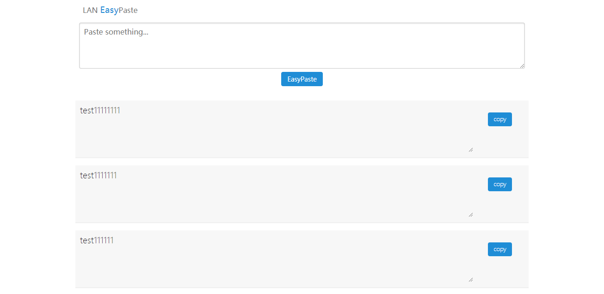

#  LANEasyPaste

无聊的时候写的一个小项目，有时候VNC连接远程机器不能复制粘贴东西，这个时候就可以用到这个小工具了。

也可以用这个小工具在局域网搭建一个小型聊天室。



## 项目特色 

- 无需数据库支持
- 仅依赖Flask

当然也分场景使用，缺点是不能缓存历史数据，前端数据通过AJAX请求更新，会造成服务端压力。

## 安装与使用

安装依赖：

```bash
pip install flask
```

运行：

```bash
python LANEasyPaste.py
```

浏览器中打开：

```bash
HTTP://YOUR IP:8080
```

可以在`LANEasyPaste.py`文件中修改缓存的历史数据条数，以及web端口。

